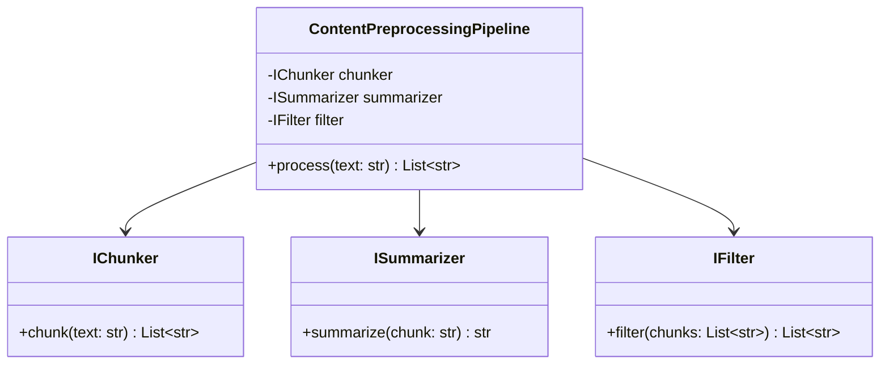

# Website Content Chunking and Summarization Strategy

## Rationale
- **LLM Context Window:** Chunking ensures content fits within LLM token limits.
- **Relevance:** Summarization extracts essential information for more accurate responses.
- **Efficiency:** Proper chunking and summarization reduce processing time and token usage.

## Chunking Types
1. **Section-based Chunking**
   - Utilize HTML structure (h1, h2, h3 tags)
   - Preserve document hierarchy and semantic structure
   - Maintain context within logical document sections
2. **Semantic/Topic-based Chunking**
   - Identify natural topic boundaries within content
   - Use embedding similarity to detect topic shifts
   - Group related content regardless of HTML structure
3. **Paragraph/Sentence-based Chunking**
   - Split by natural language boundaries
   - Implement configurable overlap between chunks
   - Balance chunk size with contextual coherence

## Summarization Approach
- **Extractive Summarization**
   - Identify and extract key sentences from content
   - Use for shorter chunks where full context is important
   - Implement ranking algorithms based on sentence importance
- **Abstractive Summarization**
   - Generate new concise text capturing essential meaning
   - Apply to longer sections using LLMs
   - Preserve critical information while reducing token count

## Architecture
- Define modular interfaces for:
   - `IChunker`: Common interface for all chunking strategies
   - `ISummarizer`: Common interface for summarization methods
- Implement strategy pattern to allow runtime selection of approaches
- Create factory classes for instantiating appropriate chunkers/summarizers

## Parameterization
- Configure chunk size based on target LLM context window
- Implement adaptive overlap based on content complexity
- Create configuration profiles for different LLMs (GPT-3.5, GPT-4, etc.)

## Content Prioritization
- Develop scoring system for content relevance
- Factors: recency, keyword density, semantic similarity to queries
- Implement priority queue for processing most relevant chunks first

## Documentation Plan
- Maintain this design document as the source of truth
- Include class diagrams showing component relationships (to be added)
- Document API interfaces and configuration options
- Update as implementation progresses

## Interface Definitions and Class Diagram

### Python Interface Definitions

```python
from abc import ABC, abstractmethod
from typing import List

class IChunker(ABC):
    @abstractmethod
    def chunk(self, text: str) -> List[str]:
        """Split input text into a list of chunks."""
        pass

class ISummarizer(ABC):
    @abstractmethod
    def summarize(self, chunk: str) -> str:
        """Summarize a single chunk of text."""
        pass

class IFilter(ABC):
    @abstractmethod
    def filter(self, chunks: List[str]) -> List[str]:
        """Filter out irrelevant or redundant chunks."""
        pass

class ContentPreprocessingPipeline:
    def __init__(self, chunker: IChunker, summarizer: ISummarizer, filter_: IFilter):
        self.chunker = chunker
        self.summarizer = summarizer
        self.filter = filter_

    def process(self, text: str) -> List[str]:
        chunks = self.chunker.chunk(text)
        summarized = [self.summarizer.summarize(chunk) for chunk in chunks]
        filtered = self.filter.filter(summarized)
        return filtered
```

### Class Diagram (Mermaid)



---

This section defines the core interfaces and shows how the pipeline composes chunking, summarization, and filtering components. Concrete implementations (e.g., SectionChunker, LangChainSummarizer, BoilerplateFilter) will subclass these interfaces. 